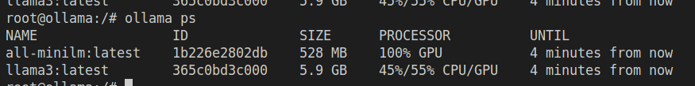

# A Guide to setup & make LLM's to run locally and use it for Building GenAI Applications like RAG(Retrival Augumented Gentration)

Do you want to do experiment with LLM's and make it run on your computer and also use it for building GenAI Applications? Then check out OLLAMA a platform that let us to do all these and more in an optimized way.

### Pre-Requrities for setting up:
- We can also install *ollama* without Docker in this setup we are using *Docker*
- NVIDIA GPU - For GPU use, otherwise we will use CPU
- *Python* version 3
- Also ensure you have enough disk space of above 15GB and better if 20% of your overall disk space is empty
- git to clone the following repo `git clone https://github.com/Surendiran2003/Local-RAG-LLM.git`

### Install ollama :
-> `cd local_llm/ollama`
<br/> 
if you don't have GPU then remove or comment the following lines from docker-compose.yml which reserves resources for GPU

 ``` docker 
  deploy:
       resources:
         reservations:
           devices:
             - driver: nvidia
               count: all
               capabilities: [gpu]
```
- Use `docker-compose up -d` in the docker-compose.yml you can see the volume path named model where we are mapping our local folder to download models
- You can also see we are using docker bridge named *genai-network* for connectivity between containers or services so that we can bring up out RAG project later.
- Check [http://localhost:11434/](localhost:11434) your localhost and ensure ollama is running
- use ollama shell for pulling llm's locally follow the cmd `docker exec -it ollama_ollama_1 bash`
replace the *ollama_ollama_1* with you container name you can see using `docker-compose ps`
- In ollama bash using the pull cmd you can pull the models that are available in ollama. 
- I am using the following models<br/> `ollama pull all-minilm` an embeddings model
`ollama pull llama3` an LLM  by Meta
- Using `ollama list` you can see the models after pulled

<br/>



- [http://localhost:3000/](localhost:8080)
you can see the *OpenWebUi* start with a login for creating an admin which also stores locally and enjoy your chat with your local LLM model.

<br/>

- 

## Setting up Basic RAG GenAI Application:

- `cd local_llm/app` in this you can see app.py, docker file, requirement.txt and a docker-compose file.
- Use `docker-compose up -d` to bring up the rag app on [http://localhost:5000/](localhost:5000)
- You can upload file and ask query related to that file the app *Retrieves* the query sementic from the pdf which is uploaded and make a prompt before prompt which is noting but *Augument* and the llm will generate the answer is know a *Generation*.

## References

* [https://ollama.com/](https://ollama.com/)
* [https://github.com/ollama/ollama](https://github.com/ollama/ollama)
* [https://streamlit.io/](https://streamlit.io/)
* [https://python.langchain.com/v0.1/docs/modules/data_connection/](https://python.langchain.com/v0.1/docs/modules/data_connection/)
* [https://docs.docker.com/desktop/gpu/](https://docs.docker.com/desktop/gpu/)
